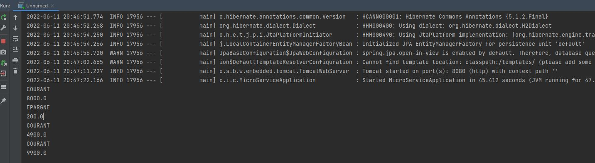
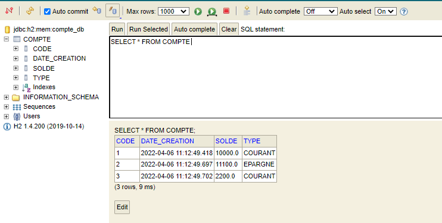
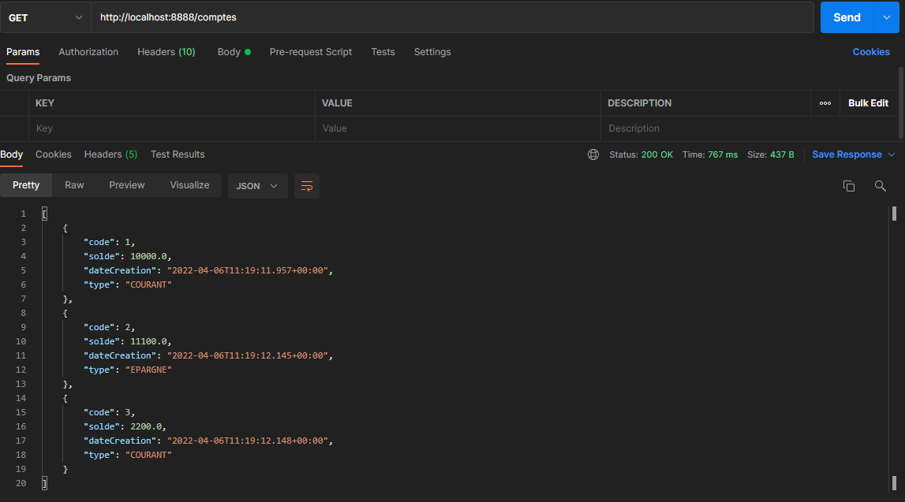
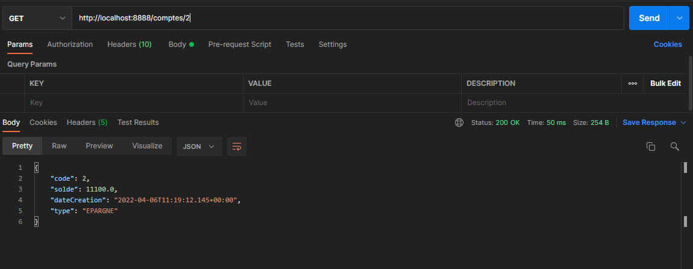
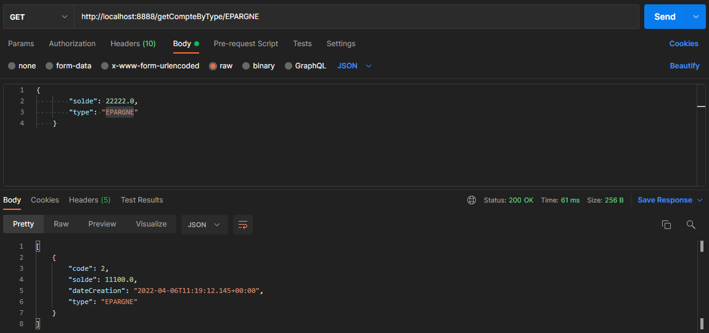
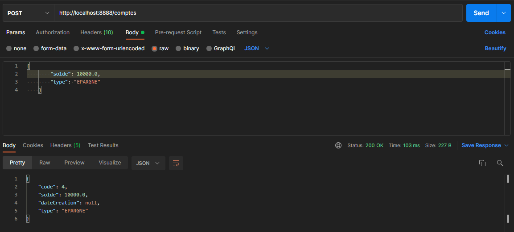
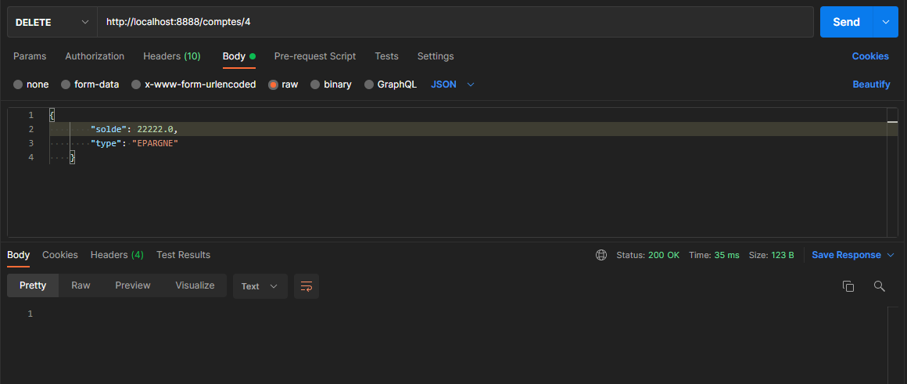
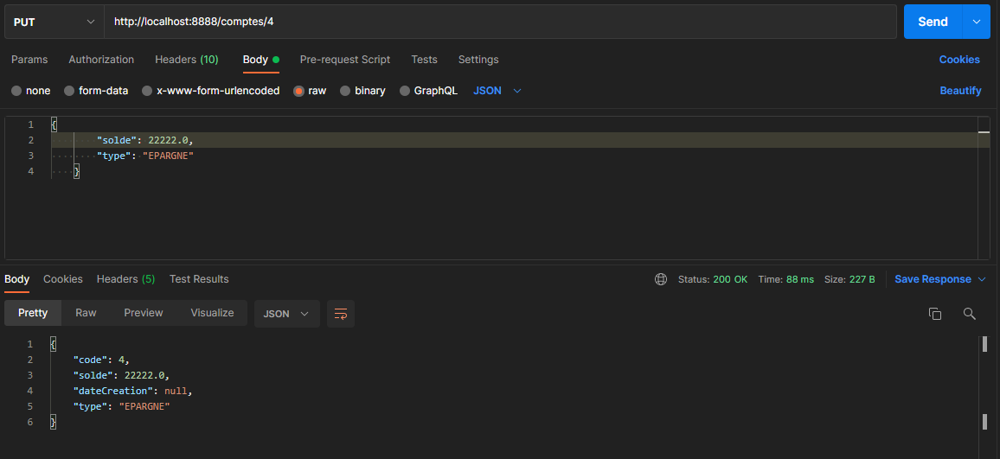
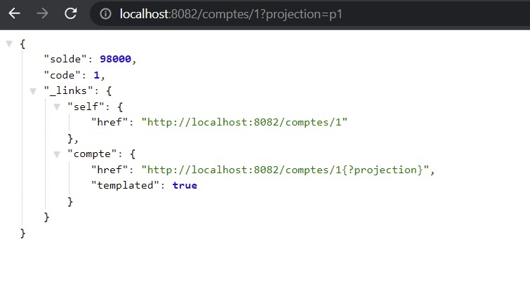
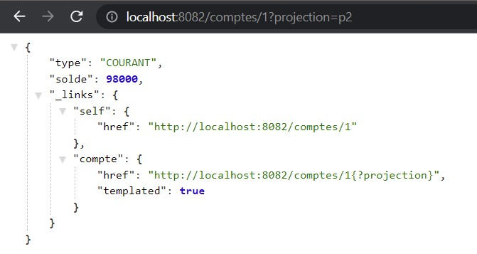

<h1>Compte Rendu</h1>

<h3>Run project</h3>

<h3>h2-console</h3>

<h3>Get Comptes</h3>

<h3>Get Compte by id</h3>

<h3>Get COmpte by type</h3>

<h3>Add Compte</h3>

<h3>Delete Compte</h3>

<h3>Update Compte</h3>

<h3>Projection 1</h3>

<h3>Projection 2</h3>
